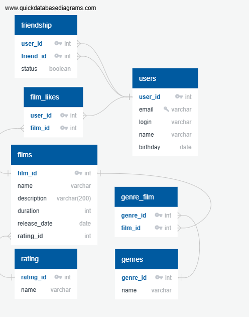

# java-filmorate

## Схема базы данных



## Описание сущностей

- **film (Фильмы):** Основная таблица с данными о фильмах (название, описание, длительность, дата выхода). Связана с рейтингами и жанрами.

- **rating (Рейтинги):** Справочник рейтингов (например, "G", "PG", "PG-13", "R", "NC-17"). Определяет возрастное ограничение фильма.

- **genre (Жанры):** Справочник жанров (например, "Комедия", "Драма", "Боевик").

- **genre_film (Жанры фильмов):** Связующая таблица для реализации связи "Многие-ко-многим" между фильмами и жанрами (один фильм может иметь несколько жанров, один жанр может принадлежать многим фильмам).

- **user (Пользователи):** Таблица с данными зарегистрированных пользователей.

- **status (Статусы дружбы):** Справочник статусов (например, "Подтвержденная", "Неподтвержденная").

- **friendship (Дружба):** Таблица для связи пользователей между собой. Реализует симметричную или асимметричную дружбу с подтверждением.

- **film_likes (Лайки фильмов):** Связующая таблица для учета, какой пользователь какой фильм лайкнул.

## Примеры SQL-запросов

1. **Операции выборки**
   
   Получить все фильмы с их рейтингом и датой выхода
   
   ```sql
   SELECT f.name as name,
         r.name AS rating,
         release_date
   FROM film f
   JOIN rating r ON f.rating_id = r.rating_id
   ORDER BY release_date DESC;
   ```

   Получить список друзей пользователя (user_id = 1)

   ```sql
   SELECT
         u.user_id,
         u.name,
         u.login,
         s.name AS Статус_дружбы
   FROM user u
   JOIN friendship f ON u.user_id = f.friend_id
   JOIN status s ON f.status_id = s.status_id
   WHERE f.user_id = 1 AND s.name = 'Подтвержденная'

   UNION

   SELECT 
        u.user_id,
        u.name,
        u.login,
        s.name AS Статус_дружбы
   FROM user u
   JOIN friendship f ON u.user_id = f.user_id
   JOIN status s ON f.status_id = s.status_id
   WHERE f.friend_id = 1 AND s.name = 'Подтвержденная';
 
2. **Операции вставки**

    Добавить фильмы

    ```sql
    INSERT INTO film (name, description, duration, release_date, rating_id)
    VALUES 
      ('Интерстеллар', 'Фантастический эпос о путешествии к червоточинам', 169, '2014-11-06', (SELECT rating_id FROM rating WHERE name = 'PG-13')),
      ('Начало', 'Триллер о внедрении в подсознание', 148, '2010-07-16', (SELECT rating_id FROM rating WHERE name = 'PG-13'));
    ```

    Добавить пользователя

    ```sql
    INSERT INTO user (email, login, name, birthday)
    VALUES
      ('ivanov@mail.ru', 'ivan_ivanov', 'Иван Иванов', '1995-08-15'),
      ('ivanova@mail.ru', 'ivana_ivanova', 'Ивана Иванова', '1995-09-15');
    ```
    Создать заявку в друзья

    ```sql
    INSERT INTO friendship (user_id, friend_id, status_id)
    VALUES (
      1,
      2,
      (SELECT status_id FROM status WHERE name = 'Неподтвержденная'));
    ```
   
